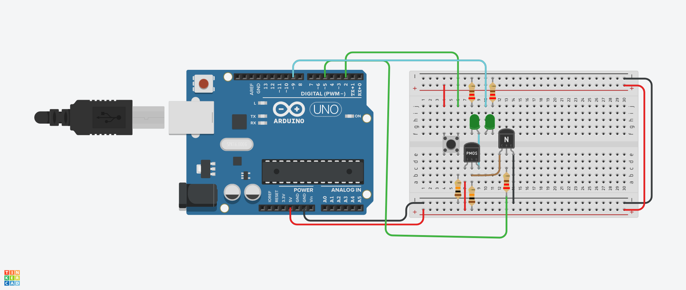

# Tinkercad Latching Power Switch

## Description
This project implements a latching power switch with auto on/off and demonstrates digital and analog power control using two LEDs in Tinkercad. The first LED is controlled via PWM for analog brightness (25%), and the second LED is controlled by a MOSFET for latching with a 10-second on, 5-second off cycle.

## Circuit Diagram

## Components and Connections
- **Pushbutton**: 
  - Pin 1b (row 4, column f) to 5V, Pin 2b (row 6, column f) to Arduino pin 2, Pin 2a (row 6, column e) to 10kΩ to GND.
- **P-channel MOSFET (IRF9540)**:
  - Source (row 8, column a) to 5V, Drain (row 10, column a) to second LED anode, Gate (row 9, column a) to transistor collector + 10kΩ to 5V.
- **NPN Transistor (2N3904)**:
  - Collector (row 12, column a) to MOSFET Gate, Emitter (row 14, column a) to GND, Base (row 13, column a) to Arduino pin 5 via 220Ω.
- **First LED (Analog, 25% brightness)**:
  - Anode (row 10, column f) to Arduino pin 9, Cathode (row 11, column f) to 220Ω to GND.
- **Second LED (Latching)**:
  - Anode (row 10, column a) to MOSFET Drain, Cathode (e.g., row 11, column e) to 220Ω to GND.
- **Resistors**:
  - 10kΩ pull-down (row 6, column e to GND).
  - 10kΩ pull-up (row 9, column a to 5V).
  - 220Ω for first LED (row 11, column f to GND).
  - 220Ω for transistor (row 13, column a to pin 5).

## Behavior
- Start: Both LEDs off.
- Push button: First LED turns on at 25% brightness, second LED turns on at full brightness.
- After 10 seconds: Both LEDs turn off.
- After 5 seconds: Both LEDs turn on again (repeats).
- Serial Monitor shows "Power ON," "Power OFF," and "Auto Power ON."

## Code
The Arduino code is in `latching_power_switch.ino`.

## Tinkercad Link

https://www.tinkercad.com/things/fF9Wx2a52y6-latching-power-switch-with-auto-power-onoff
